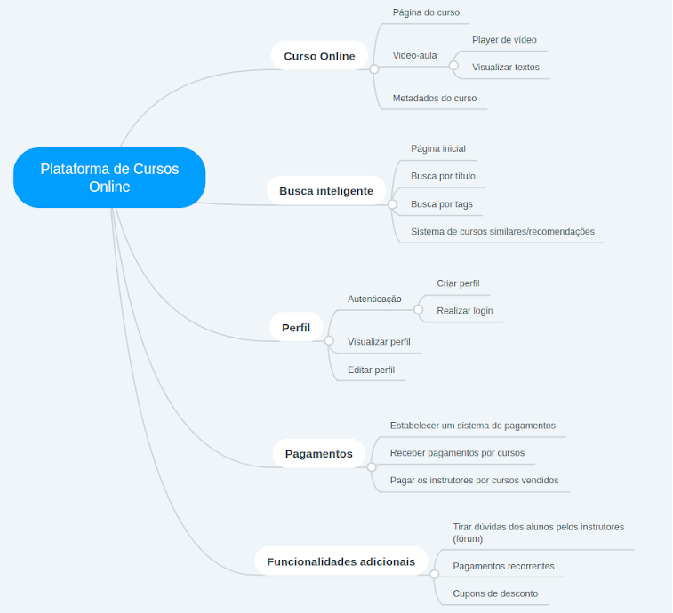
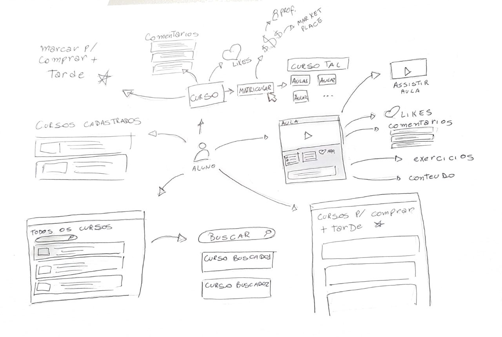
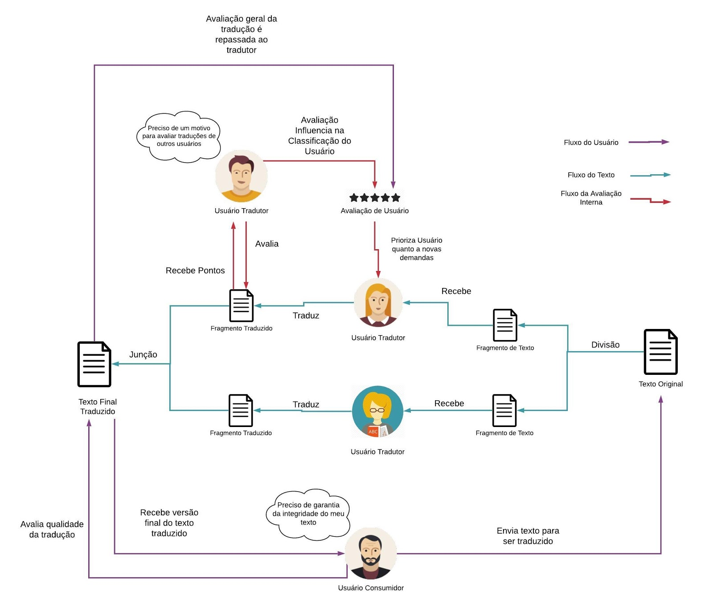

# Definição de Tema

## Histórico de Revisão:
| Data | Versão | Descrição | Autor |
|---|---|---|---|
| 12/04/2019 | 0.1 | Primeira versão do documento | Gabriela Guedes |
| 02/05/2019 | 0.2 | Refatoração do documento, adição dos tópicos 3 e 4 | Renan Schadt |
| 04/05/2019 | 0.3 | Adição dos tópicos 1 e 2 | Renan Schadt |
| 05/05/2019 | 1.0 | Adição dos tópicos 5, 6 e 7 | Renan Schadt |

## 1. Introdução
Este documento tem por finalidade definir a metodologia Design Sprint e representar a aplicação desta pelo grupo, a qual foi usada para idealizar um produto com escopo viável para a matéria de Desenho e Arquitetura de Software, contendo ainda um tema relevante e de interesse aos participantes do grupo. 

## 2. Design Sprint
A metodologia de Design Sprint é um processo de cinco dias para criar uma solução eficiente e interativa para um problema. Nela estão inseridos elementos de estratégia de negócios, inovação, design thinking, desenvolvimento colaborativo, entre outros.

Através dessa metodologia é possível reduzir o tempo de idealização de um produto, estabelecendo bem o problema e deixando que os membros criem rapidamente diversas soluções, escolhendo as melhores e validando estas com um protótipo ao invés de um MVP (Mínimo Produto Viável). Através da prototipação é possível ter um vislumbre do produto finalizado antes de tomar decisões precipatadas.

As seis fases do Design Sprint estão detalhadas abaixo, compreendendo os cinco dias de trabalho e a fase de preparação.

**Preparação - Fase Understand**

Na preparação para aplicar a metodologia é necessário preparar o tempo e espaço adequado para condução da dinâmica, além de entender o problema e compartilhar o conhecimento entre os membros participantes acerca deste.

**Segunda - Fase Define**

Nesta fase o time avalia o problema, define sua "linha de ataque", contexto das possíveis soluções, além de objetivos e métricas de sucesso.

**Terça - Fase Sketch**

Nas duas fases anteriores os participantes entenderam o problema e estabeleceram o foco da solução. Na fase Sketch cada membro do time irá elaborar sua solução individual e gerar artefatos visuais detalhando-a.

**Quarta - Fase Decide**

Na fase Decide, os participantes apresentam suas soluções e o time enumera os pontos positivos e negativos destas, a partir dessa análise, chegam em um consenso da solução final a ser levada para prototipação.

**Quinta - Fase Prototype**

Na fase Prototype, o time irá criar um protótipo simples da solução definida na fase anterior, detalhado o suficiente para ser validado com clientes reais.

**Sexta - Fase Validate**

Depois de criar o protótipo do que foi considerada a melhor solução, o time irá validá-lo observando a reação de terceiros, conseguindo extrair diversos feedbacks e tendo um direcionamento claro do que o produto deve ser, podendo assim definir os passos para alcançar esse objetivo.

## 3. Artefatos Construídos
Para idealização e elucidação das propostas de tema, foram construídos diversos artefatos, abaixo estão descritos quais são, o que são, seu propósito e porque o fizemos. Uma descrição mais detalhada dos artefatos do tema escolhido, pode ser encontrada na pasta "Requisitos", sub-pasta "Modelagem".

### 3.1 Rich Picture
Um rich picture é um desenho de uma situação ou fluxo, que ilustra seus elementos e relacionamentos. Pode conter imagens, textos, símbolos, ícones, entre outros elementos usados para ilustrar algo graficamente. Ele ajuda a entender e desmantelar processos complexos, se baseando no fato de que nosso cerébro consegue absorver melhor imagens do que palavras.

### 3.2 5W2H
O 5W2H é um método simples e de fácil aplicação para elucidar a visão dos stakeholders sobre o produto, respondendo sete questões fundamentais, que dão o nome ao método.
1. O que será feito? Descrição do produto (What).
2. Por que será feito? Razão de existência do produto (Why).
3. Onde será feito? Local onde é feito o desenvolvimento (Where).
4. Quando será feito? Datas, prazos (When).
5. Quem irá fazer? Responsáveis pelo produto (Who).
6. Como será feito? Metodologia, processos envolvidos (How).
7. Quanto irá custar? Custo de desenvolvimento, despesas envolvidas (How much).

### 3.3 Mapa Mental
Um mapa mental é uma ilustração de diversos objetos e suas conexões, tem o propósito de elucidar o entendimento de um tema e conectar seus elementos. Pode ser aplicado em diversas áreas do conhecimento, mapeando este assunto, fixando e amadurecendo o conhecimento dos indivíduos neste.

### 3.4 Protótipo
Um protótipo de software, é uma previsão de como a aplicação será visualmente, quando terminado seu período de desenvolvimento. Seu principal propósito é ser mostrado aos __stakeholders__, para que avaliem o direcionamento do produto e determinem possíveis oportunidades de melhora.

## 4. Propostas de Tema
Este tópico compreende os temas gerados pelo grupo com o objetivo de gerar um produto com escopo que atenda os requisitos da disciplina de Desenho e Arquitetura de Software (Fase Understand).

Os temas foram definidos individualmente e surgiram de necessidades do mercado percebidas pelos membros, como a dificuldade de se traduzir um texto técnico ou obter bases de dados relevantes para algoritmos de aprendizado de máquina.

Abaixo estão definidos os temas (Fase Define) e os artefatos construídos para comprovar sua viabilidade e melhor visualizá-los (Fase Sketch).

### 4.1 Marketplace de Video Aulas

#### 4.1.1 Definição
Uma das ideias do grupo, foi a construção de um marketplace de vídeo aulas, onde é possível adquirir cursos e criar seus próprios para a venda. Foi pensado, tendo em mente plataformas como a Udemy, com um incentivo a alunos para criarem cursos das suas áreas de domínio. Conta com diversas funcionalidades extras para dar suporte ao produto, como busca inteligente, listas de desejo, cupons de desconto, foruns de dúvida, entre outros.

#### 4.1.2 Mapas Mentais
Mapa mental mostrando conexão entre áreas da aplicação e algumas regras de negócio.

Mapa mental mostrando parte do conteúdo das principais áreas da aplicação.

#### 4.1.3 Rich Picture
Rich picture desenhado a mão ilustrando pequenos protótipos das áreas principais da aplicação.

### 4.2 Crawler para Mineração de Dados

#### 4.2.1 Definição
Uma das ideias do grupo, foi a construção de um crawler para mineração de dados, embasada pela experiência de alguns membros, na dificuldade de se obter bases de dados para uso em algoritmos de inteligência artificial. 

"Os crawlers coletam documentos de base de dados para que estes possam ser analisados, indexados, procurados e extraídos (IBM)". A aplicação prevista, iria vender diferentes crawlers para diferentes propósitos, como crawlers para extração em bancos não relacionais, arquivos de texto, entre outros. 

#### 4.2.2 5W2H
1. What ?
	* O produto a ser feito é um marketplace que venderá dados que serão gerados através de um crawler ou, como é dito no meio de DataScience, será feito um data mining.
	* O produto também vai funcionar como um sistema de requisições de dados, ou seja, conforme a necessidade dos clientes que usaram o site, um crawler específico será feito para aquela pessoa caso seja assinado o pacote premium do site.
2. When ?
	* Tudo será produzido no tempo da disciplina, de no mínimo um MVP do escopo feito no começo do semestre e o máximo de entrega final dos seminários ao final da matéria, sendo este o prazo total de produção.
3. Who ?
	* Todo o serviço será feito pelo grupo que foi determinado no começo da matéria.
4. Where ?
	* Todo o trabalho será feito na UnB, campus do Gama, nos locais predeterminados pelo grupo, nos pareamentos e nas reuniões.
5. Why?
	* Esse produto será feito graças a uma necessidade em obter dados para aprendizado de máquina e estudos de mercados no geral, relatados em artigos como:   

    |Tipo|Assunto|Link|
    |	---	| ---	 | --- |
    |Fórum|O que é mais importante? Bons dados ou Bons algoritmos?|https://www.quora.com/Is-good-data-or-good-algorithm-more-important-in-machine-learning|
    |Artigo| Desmitificando aprendizado de máquina: A importancia de dados|https://www.quora.com/Is-good-data-or-good-algorithm-more-important-in-machine-learning|
    |Artigo| A importancia da coleta de dados para seu negócio|https://www.simplybusiness.co.uk/knowledge/articles/2010/06/2010-06-03-why-marketing-data-is-important-to-a-growing-business/|
    |Artigo Científico|Reality Check: Combinando Experiências de Escolha com Dados de Mercado para Estimar a Importância dos Atributos do Produto.|https://pubsonline.informs.org/doi/pdf/10.1287/mnsc.1090.1136|
    |Artigo científico|Sistemas e métodos para aprendizado de máquina e gerenciamento de dados|https://patentimages.storage.googleapis.com/21/3d/63/eaa0b260547816/US6845340.pdf|
    |Artigo científico|Tecnicas de aprendizado de máquina para mineração de dados: A pesquisa|https://ieeexplore.ieee.org/abstract/document/6724149/|

6. How ?
	* Esse produto será feito em Django e React com banco de dados não relacional. Terá um estudo de requisitos dentro de mercado, o qual será exposto pelo grupo, como dispor os dados da melhor maneira para os pesquisadores e as empresas que os necessitem para a realização e desenvolvimento de suas próprias pesquisas internas.
	* Será usado um método misto para o gerenciamento da equipe usando documentos essenciais do RUP, gerenciamento do scrum, algumas documentações e estilo de pareamento do extreme programing.

7. How much?
	* A precificação será realizada após a escolha do tema do grupo.

#### 4.2.3 Protótipo
Protótipo de baixa fidelidade ilustrando a tela inicial do marketplace de crawlers.

### 4.3 WebApp para Tradução de Artigos

#### 4.3.1 Definição 
Um dos projetos pensados pelo grupo foi uma aplicação web que serve como uma ferramenta de aproximação entre um cliente que precisa de uma tradução profissional e tradutores freelancers que buscam uma alternativa extra de renda. A ideia do projeto se originou a partir da dificuldade de se traduzir um texto acadêmico e do preço elevado cobrado por profissionais da área.

A plataforma pensada pelo grupo descentraliza a tradução, para que não seja feita por somente um tradutor, permitindo a tradução de textos privados, estudos não-publicados, patentes e demais propriedades intelectuais que poderiam ter seu conteúdo exposto se a tradução é realizada somente por um profissional.

#### 4.3.2 Mapa Mental
Mapa mental com foco nos dois tipos de usuários da aplicação, mostrando algumas de suas ações.

#### 4.3.3 Rich Pictures
Rich picture ilustrando caminho do artigo ao ser traduzido.

Rich picture com foco na interação entre usuário e tradutor.

Rich picture ilustrando a divisão do texto original em fragmentos, distribuídos entre tradutores.

## 5. Definição de Tema
Os temas propostos foram julgados pelos participantes do grupo e no final foi decidido o vencedor (Fase Decide).

### 5.1 Marketplace de Video Aulas
Pontos Positivos:
1. Tema conhecido entre os membros.
2. Permite uso de linguagens e frameworks de preferência do grupo.
3. Plataforma com apelo para o universo acadêmico.
4. Ótimo portfólio por se tratar de um marketplace.

Pontos Negativos:
1. Concorrência gigantesca e estabelecida no mercado (Udemy, Udacity, entre outros).
2. Alguns membros do grupo não iriam obter novos conhecimentos.
3. Poucas inovações para se diferenciar da concorrência.

### 5.2 Crawler para Mineração de Dados
Pontos Positivos:
1. Tema extremamente relevante para o mercado.
2. Pouca concorrência.
3. Permite uso de linguagens e frameworks de preferência do grupo.
4. Tema despertou interesse do grupo.

Pontos Negativos:
1. Incerteza se o escopo é adequado a matéria.
2. Perigos de lidar com dados de terceiros.
3. Completo desconhecimento por parte da maioria dos membros do grupo sobre todos aspectos e particularidades do produto.

### 5.3 WebApp para Tradução de Artigos:
Pontos Positivos:
1. Permite uso de linguagens e frameworks de preferência do grupo.
2. Plataforma com apelo para o universo acadêmico.
3. Pouca concorrência.
4. Inovações relevantes para se diferenciar da concorrência.

Pontos Negativos:
1. Sistema com muitas regras de negócio.
2. Nicho de mercado bem específico e exigente.

### 5.4 Escolha do Tema
Depois de apontar os pontos positivos e negativos de cada ideia, foi realizada uma votação que buscava enfim decidir qual projeto seria o executado no decorrer da disciplina.

Assim, o tema escolhido foi o **WebApp para Tradução de Artigos**.

## 6. Conclusão
A técnica de Design Sprint foi extremamente eficaz para ajudar a definir o produto a ser construído, permitiu muita interação entre o grupo e discussão sobre os temas propostos, através dessas discussões foi possível verificar diversas regras de negócio e evoluir as soluções propostas. O protótipo contruído para ilustrar o produto se encontra na aba [Protótipo](requisitos/elicitacao/prototipo.md) (Fase Prototype).

Com a ideia do produto definida e validada foi possível seguir para a fase de Requisitos.

## 7. Referências
* [Crawler](https://www.ibm.com/support/knowledgecenter/pt-br/SS5RWK_3.5.0/com.ibm.discovery.es.nav.doc/iiysaovcompc.htm)
* [5W2H](https://www.heflo.com/blog/action-plan/5w2h-method/)
* [Desmitificando aprendizado de máquina: A importancia de dados](https://www.quora.com/Is-good-data-or-good-algorithm-more-important-in-machine-learning)
* [A importancia da coleta de dados para seu negócio](https://www.simplybusiness.co.uk/knowledge/articles/2010/06/2010-06-03-why-marketing-data-is-important-to-a-growing-business/)
* [Reality Check: Combinando Experiências de Escolha com Dados de Mercado para Estimar a Importância dos Atributos do Produto](https://pubsonline.informs.org/doi/pdf/10.1287/mnsc.1090.1136)
* [Sistemas e métodos para aprendizado de máquina e gerenciamento de dados](https://patentimages.storage.googleapis.com/21/3d/63/eaa0b260547816/US6845340.pdf)
* [Tecnicas de aprendizado de máquina para mineração de dados: A pesquisa](https://ieeexplore.ieee.org/abstract/document/6724149/)
* [Rich Picture](http://www.mspguide.org/tool/rich-picture)
* [Google - Design Sprint](https://designsprintkit.withgoogle.com/methodology/overview)
* [GV - Design Sprint](https://www.gv.com/sprint/)
