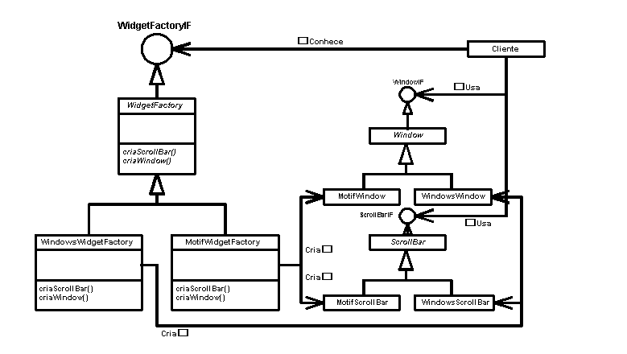

# Abstract Factory

## Histórico de Revisão:
| Data | Versão | Descrição | Autor |
|---|---|---|---|  
| 13/05/2019  | 0.1 | Inclusão da estrutura do documento | Helena Goulart|
| 13/05/2019  | 0.1 | Definição da _Abstract Factory e da possibilidade de inclusão no projeto | Helena Goulart|

## 1. Introdução

O _Abstrac Factory_ é um padrão de projeto conhecido como Gang of Hour Criacional, apresentado
pela docente Milene Serrano na disciplina Arquitetur e Desenho de Software. Este documento
apresenta as principais informações necessárias para que todos os membros da equipe possam estudar
o padrão, compreende-lo e entender sua aplicabilidade no projeto translate.me.

## 2. O que é?

Trata-se da criação de famílias de objetos relacionados ou dependentes por meio de apenas uma interface gráfica e sem que a classe concreta seja especificada, uma vez que essa classe é alocada numa fábrica. Este padrão assemelha-se bastante ao _Factory Method_, contudo procura eliminar o código de criação aplicado com a palavra reservada _new_,  

O diagrama abaixo demonstra a estrutura mínima exigida para a aplicação do _Abstract Factory_.

## 3. Por que usar?

## 4. Códigos de exemplo

## 5. É aplicável no projeto translate.me?
Sim, porém por ter uma estrutura mínima bastante complexa, não é um padrão de projeto muito recomendado devido sua aplicação. Normalmente, o que o _Abstract Factory_ faz, poderia ter sido resolvido pelo _Factory Method_, porém com um diferente nível de acoplamento.

## 6. Referências bibliográficas
