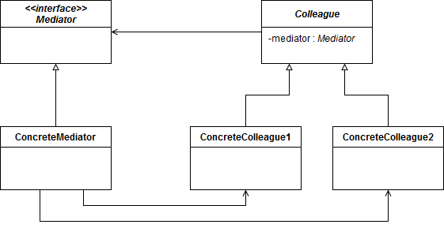

# GoFs Comportamentais

## Histórico de Revisão:
| Data | Versão | Descrição | Autor |
|---|---|---|---|
| 27/05/2019 | 0.1 | Adicionando Mediator | Renan Schadt e Rômulo Souza |
| 27/05/2019 | 0.2 | Adicionando Observer | Renan Schadt |

## 1. Introdução

## 2. GoFs Comportamentais

### 2.1 Mediator

#### 2.1.1 Definição
Mediator é um padrão de design comportamental que impede a comunicação direta entre objetos, tem a função de evitar uma rede caótica de dependências, para fazê-lo o Mediator força os objetos a se comunicar indiretamente, usando de um objeto "mediador". 

Ao se chamar um objeto Mediator ele redireciona as requisições para os componentes apropriados, como resultado os componentes dependem apenas do Mediator ao invés de estarem ligados a diversas outras classes. 

Este padrão permite encapsular uma complexa rede de relações entre componentes dentro de um objeto, tornando o sistema mais legível e fácil de modificar.

O padrão Mediator contém os seguintes elementos:

1. Diversos componentes, que são classes que contém lógica de negócio. Cada componente tem uma referência ao mediador, declarado com o tipo da interface do mediador.

2. Uma interface Mediator que declara métodos de comunicação entre componentes.

3. Uma classe Concrete Mediator que encapsula a relação entre vários componentes, guardando as suas referências e gerenciando seus ciclos de vida.

#### 2.1.2 Análise
Após avaliação dos Requisitos chegamos a conclusão que o padrão Mediator se aplica a uma área de nossa aplicação, onde uma classe mediadora organizaria os tradutores e revisores responsáveis por algum fragmento de texto específico.

O Django possui formas já definidas de realizar essa tarefa, que correspondem a lógica do Mediator, usaremos dessas funções.

#### 2.1.3 Estrutura Mínima

### 2.2 Observer

#### 2.2.1 Definição
Observer é um padrão de design comportamental, que define um mecanismo que notifica múltiplos objetos sobre qualquer evento que ocorra com o objeto que estão observando.

O objeto observado é normalmente definido como Publisher, pois divulga suas mudanças de estado. Os objetos que desejam acompanhar essas mudanças são chamados de Subscribers.

O padrão Observer sugere adicionar um mecanismo de inscrição a classe Publisher, para que outros objetos possam se inscrever ou desinscrever dos sinais disparados por aquele Publisher. É crucial que os Subscribers implementem a mesma interface do Publisher.

Assim que ocorre um novo evento, o Publisher itera sobre a lista de inscritos e chama o método de notificação declarado na interface do Subscriber, em cada objeto Subscriber presente na lista.

O padrão Observer contém os seguintes elementos:

1. Um Publisher, que é o elemento observado, contendo um sistema de inscrição, que permite que Subscribers o acompanhem ou deixem de acompanhá-lo.

2. Uma interface Subscriber, que declara a interface de notificação.

3. Classes de Concrete Subscribers, que realizam ações em resposta a eventos disparados pelo Publisher.

#### 2.2.2 Análise
Após a análise da documentação do Django chegamos a conclusão que este framework já aplica o Observer nativamente, não sendo necessária a construção da estrutura mínima descrita abaixo, visto que ela já está pronta.

#### 2.2.3 Estrutura Mínima

## 3. Referências
* [Guru Design Patterns - Mediator](https://refactoring.guru/design-patterns/mediator)
* [Guru Design Patterns - Observer](https://refactoring.guru/design-patterns/observer)