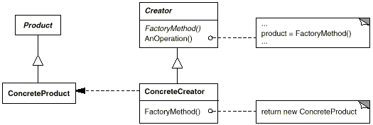
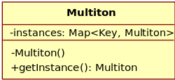

# GoFs Criacionais

## Histórico de Revisão:
| Data | Versão | Descrição | Autor |
|---|---|---|---|
| 20/05/2019 | 0.1 | Adicionando Multiton GOF | Gabriela Guedes |
| 20/05/2019 | 0.2 | Adicionando Factory Method GOF | Renan Schadt |

## 1. Introdução

## 2. GoFs

### 2.1 Factory Method

#### 2.1.1 Definição
O _Factory Method_ é um padrão de design criacional que provê uma interface para criação de objetos em uma superclasse, mas permite que as subclasses alterem o tipo dos objetos que serão criados, este padrão sugere a substituição de chamadas diretas de construção de objeto, com chamadas para um método especial de criação.

O padrão _Factory Method_ contém os seguintes elementos: 

1. Uma interface ilustrando um Produto (ex: Carro), contendo métodos (ex: acelerar, frear) e atributos (ex: cor, volume do porta malas) que pertençam a todos produtos.

2. Uma especialização de Produto, Produto Concreto (ex: Carro Honda, Carro Fiat), que contenha a implementação dos métodos definidos na interface, e possíveis métodos e atributos extras.

3. Uma classe Criador (Fábrica de Carros), que contenha um método de criação base, que pode ser sobrescrito pelas suas filhas e que retorne um Produto. O Criador pode ser uma classe abstrata para forçar que as filhas implementem suas próprias versões de seus métodos, ou uma classe padrão, que pode criar um Produto Concreto. 

4. Uma especialização de Criador, Criador Concreto (ex: Fábrica de Carros Honda, Fábrica de Carros Fiat), que sobrescreve o método base do Criador e returna um tipo diferente de Produto.

No tópico 2.1.3, uma imagem ilustra a estrutura mínima desse padrão, para melhor visualizar os conceitos descritos acima.

#### 2.1.2 Análise
A análise feita pelo grupo é de que o padrão _Factory Method_ pode ser implementado no projeto. O texto submetido pelo usuário autor, na nossa aplicação, contém um nível de complexidade, definido por esse mesmo usuário, níveis de complexidade diferentes exigem mudança no valor final da tradução, no prazo de entrega, no número de revisões feitas, entre outros.

A partir desta ideia podemos definir que: O texto seria nosso Produto, os textos com complexidade Fácil, Média ou Avançada, seriam nossos Produtos Concretos. Eles teriam um Criador (Fábrica de Textos), com um método de criação a ser sobrescrito pelas classes filhas (Fábrica de Texto com Complexidade Fácil, Fábrica de Texto com Complexidade Média).

Assim teremos uma solução elegante para criação de objetos de texto, dando poucas atribuições a cada classe, facilitando a manutenção e caso seja preciso adicionar um novo nível de complexidade, é possível fazê-lo facilmente, sem quebrar o processo de criação dos Produtos Concretos já existentes.


#### 2.1.3 Estrutura Mínima


## 2.2. Multiton

### 2.1.1 Definição
O multiton consiste na utilização de um método para retornar um objeto. Esse método deve receber uma chave, e caso já exista um objeto com essa chave, ele é retornado, caso contrário, um novo objeto é criado. O multiton é considerado uma extensão do padrão de projeto singleton, onde o método de criação de objetos deve ser privado e que só permite a criação de uma instância para a classe, no caso do multiton, é utilizado um dicionário para agrupar todas as instancias geradas.

### 2.1.2 Análise
É possivel a implementação do Multiton em nosso projeto, veja o exemplo de implementação em python:

``` py
def multiton(cls):
   instances = {}
   def getinstance(id):
      if id not in instances:
         instances[id] = cls(id)
      return instances[id]
   return getinstance


@multiton
class MyObject( object ):
   def __init__( self, arg):
      self.id = arg

a = MyObject(1)
b = MyObject(2)
c = MyObject(2)

print("Should be False:")
print(a is b)

print("Should be True:")
print(b is c)
```

### 2.1.3 Estrutura Mínima



* Mapeamento das instâncias a partir da chave
* Inicializador da classe
* Método `getInstance()` que retorna um objeto da classe

## 3. Referências
* [Black Wasp - Multiton](http://www.blackwasp.co.uk/Multiton.aspx)
* [Stack Overflow](https://stackoverflow.com/questions/669932/how-to-create-a-class-that-doesnt-re-create-an-object-with-identical-input-para)
* [Refactoring Guru - Factory Method](https://refactoring.guru/design-patterns/factory-method)
* [Aula GoFs Criacionais - Milene Serrano](https://aprender.ead.unb.br/mod/resource/view.php?id=46112)