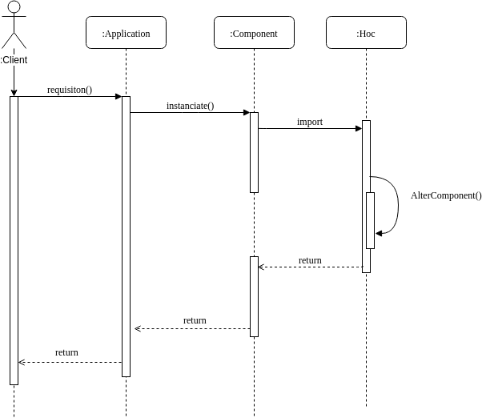
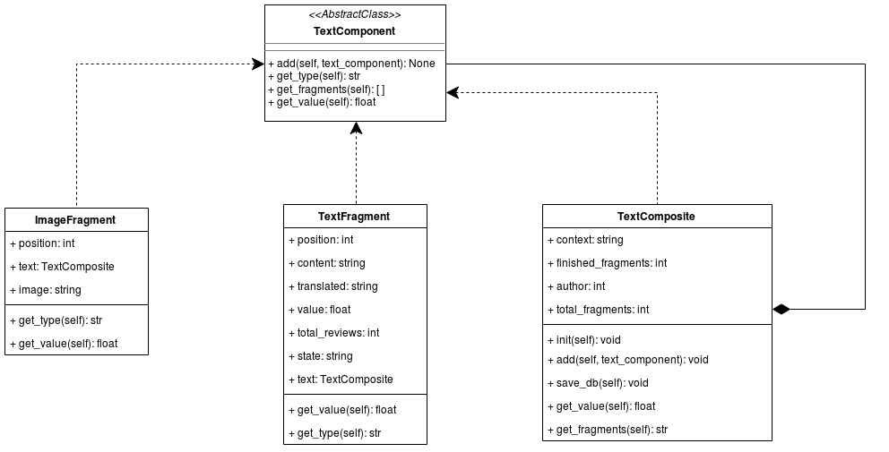

# GOFs Vs. Emergentes

## Histórico de Revisão
| Data | Versão | Descrição | Autor |
|---|---|---|---|
| 26/05/2019 | 0.1 | Adicionada estrutura do documento | Luiz Guilherme |
| 26/05/2019 | 0.2 | Adicionada explicação sobre HOCs | Luiz Guilherme |
| 26/05/2019 | 0.3 | Adicionados exemplos de implementação | Luiz Guilherme |
| 26/05/2019 | 0.4 | Adidionando tentativas falhas do Multiton e Observer | Gabriela Guedes e Letícia Meneses |
| 26/05/2019 | 0.5 | Adicionando descrição e análise do Composite | Renan Schadt e Rômulo Souza |

## 1. High-order Components
### 1.1 O que é?

Um High-order component (HOC) é um padrão de projeto emergente aplicável em React para reutilizar lógicas de componente. HOCs não são partes do comportamento padrão do React e ele surge da natureza composicional do React. De forma breve, um HOC é uma função que recebe um componente como entrada e retorna um novo componente, com novos atributos.

Por muito tempo, o HOC foi o padrão mais popular para aprimorar e compor elementos em React e sua estrutura se assemelha com o padrão de um decorator, pois existe o encapsulamento do componente e o seu aprimoramento.

Para todas os efeitos práticos, 'decorators' e HOCs fazem a mesma coisa, porém quando você adiciona um decorator, a classe somente pode ser utilizada em sua forma decorada. O padrão HOC quando implementado, permite a utilização tanto do componente de ordem superior e de ordem inferior.

#### 1.2 Benefícios
* Reaproveitamento de código da classe que teve o padrão de projeto aplicado;
* Outra característica do padrão é a criação de um buffer para lógica adicional. Por exemplo, se um componente acessa um servidor remoto, pode-se enfileirar estes dados em HOC e envia-lo como uma propriedade (prop).

#### 1.3 Estrutura

##### 1.3.1 Diagrama de Classes


##### 1.3.2 Diagrama de Sequência



### 1.4 Exemplo
Um exemplo trivial seria este, que define uma função que implementa o HOC, que recebe como parâmetro um componente chamado OriginalTitle e retorna em um outro componente chamado EnhancedTitle, uma nova versão do componente, porém com alguns 'props' adicionados.

```
var enhanceComponent = (Component) =>
  class Enhance extends React.Component {
    render() {
      return (
        <Component {...this.props} />
      )
    }
  };

var OriginalTitle = () => <h1>Hello world</h1>;
var EnhancedTitle = enhanceComponent(OriginalTitle);

class App extends React.Component {
  render() {
    return <EnhancedTitle />;
  }
};
```

### 1.5 É aplicavel em nosso projeto?
A estrutura do HOC é facilmente aplicável no translate.me em todos os componentes que se aproveitam do _Redux_ para manipulação de estados da aplicação:

__Redux:__ A utilização do Redux aplica por padrão uma versão do High-order Component, que é conhecida como _connect_. Da mesma forma que apresentado, o Redux recebe como parâmetro um componente e adiciona todos os parâmetros presentes na store do Redux ao componente que foi 'conectado' e a partir de agora os dois componentes são acessíveis, em sua versão de alta-ordem e na versão original, 'não-conectada'.

#### Exemplo prático
A aplicação do Redux em nosso projeto e consequentemente pode ser exemplificada neste fragmento de código:

```
import React, { Component } from 'react';
import SimpleFooter from '../Components/SimpleFooter';
import store from './reduxStore';

class TextEditor extends React.Component {
  constructor(props) {
    super(props);
    this.state = {editorState: EditorState.createEmpty()}
  }

  render() {
    return (
      <div>
        <SimpleFooter>
            <Container>
                {...}
            <Container />
        <SimpleFooter/>
      </div>
    );
  }
}

const mapStateToProps = function(state) {
  return {
    profile: state.user.profile,
    loggedIn: state.auth.loggedIn
  }
}

export default connect(mapStateToProps)(TextEditor);
```

## 2. Composite

### 2.1 O que é?
O Composite é um padrão de design estrutural que permite atrelar objetos diferentes através de uma mesma interface, para fazer alguma operação sobre todos ou trabalhar com estes individualmente.

O uso do Composite, faz sentido quando o que se tem interesse em representar, pode ser mostrado através de uma estrutura de árvore. O Composite é usado quando se deseja tratar elementos simples e complexos da mesma maneira.

### 2.2 Estrutura


### 2.3 Aplicação
Nossa aplicação de Composite, leva em conta que um texto, contém fragmentos e estes podem conter textos, imagens, tabelas, entre outros. 

Usando a mesma interface para os vários tipos de fragmentos (Composite), é possível realizar operações sobre uma lista destes, como a operação para somar o valor total de tradução do texto.

## 3. Helena

<!-- Deixem isso por ultimo plis :) -->
## 4. Padrões não aplicaveis para o projeto

### 4.1 Multiton
#### 4.1.1 O que é?
O multiton consiste na utilização de um método para retornar um objeto. Esse método deve receber uma chave, e caso já exista um objeto com essa chave, ele é retornado, caso contrário, um novo objeto é criado.


#### 4.1.2 Como tentamos implementar
Tentativa da implementação do multiton foi na criação de categorias para o texto, onde ele verificaria se já não existe uma catogoria criada com o mesmo nome.

#### 4.1.3 Porque não funciona
O Django Rest contem a serializer que já faz a verificação dos campos com o banco de dados, o que torna a utilização do multiton desnecessária. Além de que para implementar este padrão de projeto, seria necessário sobreescrever a serializer, pois não há acesso direto a classe pelos metodos post. A sobrescrita ou o não uso da serializer seria um erro para o projeto já que ela é responsável por converter dados complexos para tipos JSON e xml e assim validando esses dados.

### 4.2 Observer
#### 4.2.1 O que é?
É um padrão de projeto que define uma dependência de um para muitos entre objetos, de modo que, quando um objeto muda o estado todos os seu dependentes são notificados e atualizados automaticamente. Permite que objetos interessados sejam avisados da mudança de estado ou outros eventos ocorridos em outro objeto.


#### 4.2.2 Como tentamos implementar
##### 4.2.2.1 Tentativa 1 - Atualizar o Texto de acordo com os Fragmentos
A ideia inicial era que de acordo com os estados do andamento dos fragmentos de tradução do texto, o estado do texto final fosse atualizado para que o autor soubesse do andamento do seu texto.

##### 4.2.2.2 Tentativa 2 - Atualizar os Fragmentos para inativo quando o pedido de tradução for cancelado
A tentativa consistiu em que quando um pedido de tradução fosse cancelado, todos os seus fragmentos também ficassem inativos.

#### 4.2.3 Porque não funciona
##### 4.2.3.1 Tentativa 1 - Atualizar o Texto de acordo com os Fragmentos
Essa implementação foge da definição do padrão Observer, pois estariamos aplicando uma notificação de muitos para um, enquanto o padrão funciona de um para muitos. Logo sendo descartado no inicio da implementação.

##### 4.2.3.2 Tentativa 2 - Atualizar os Fragmentos para inativo quando o pedido de tradução for cancelado
A plataforma Django, junto com o SQL, já possui vários métodos internos que fazem esta função de remover os fragmentos relacionados ao texto por uma chave estrangeira.

## 3. Referências

### 3.1 Links de sites
* [React and Redux - When and how to use it](https://blog.logrocket.com/react-redux-connect-when-and-how-to-use-it-f2a1edab2013)
* [High-order Components](https://tylermcginnis.com/react-higher-order-components/)
* [HOC Examples](https://medium.com/@franleplant/react-higher-order-components-in-depth-cf9032ee6c3e)

### 3.2 Livros e artigos

[1] LISBÔA, Jonivan Coutinho; DE CARVALHO, Sérgio Teixeira; LOQUES FILHO, Orlando Gomes. Um Design Pattern para Configuração de Arquiteturas de Software. In: The 2nd. Latin America Conference on Progamming Languages of Patterns. 2002. <br>
