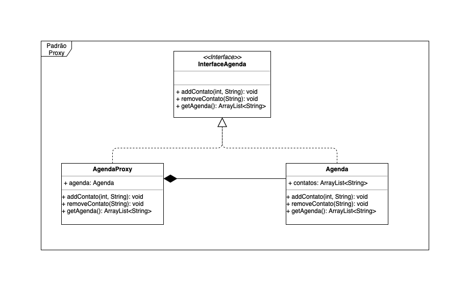

# GOFs Proxy e Facade

## Proxy
### O que é?
Proxy é um padrão de design estrutural, responsável por controlar o acesso a um objeto, agindo como um "substituto" do objeto real.

No padrão Proxy se faz necessário a criação de uma classe que implementa a mesma interface implementada pelo serviço, o proxy deve seguí-la para poder se passar por este. Ao receber uma requisição de um cliente, o proxy realiza suas funções (cache, lazy initialization, entre outros) e delega o trabalho principal ao serviço real.

O proxy permite a execução de rotinas antes ou depois da requisição ser repassada ao serviço, como ele é implementado com a mesma interface deste, pode ser passado a um cliente que espera o serviço real.

Entre as aplicações mais relevantes do Proxy é possível citar:
1. _Lazy initialization_ (atrasar a inicialização de um objeto, até ele ser usado). Assim é possível evitar desperdício de recursos, não criando o objeto na inicialização do aplicativo, sendo que este é pesado e raramente necessário.

2. Controle de acesso, permite limitar quais clientes podem fazer uso de um serviço específico, o proxy passa a requisição ao serviço real, somente se as credenciais do cliente atendem aos critérios propostos. 

3. Execução local de um servidor remoto, ou seja, quando uma ação é feita pelo cliente (local), o proxy repassa esta ação através de uma requisição pela rede e processada no servidor.

4. Lidar com registro de requisições. O proxy pode armazenar cada requisição antes de direcioná-la, o que é útil para manter um histórico de requisições feitas ao serviço.

5. Armazenar resultados em cache. O proxy armazena os resultados das requisições dos clientes em cache, aumentando o desempenho caso hajam requisições recorrentes que retornam o mesmo o resultado. 

6. Desalocação de recursos em serviços não utilizados. O proxy mantém os registros dos clientes que possuem uma referência à instância do serviço, e pode desativá-lo, caso nenhum cliente que faça uso deste serviço esteja ativo.

#### Benefícios
* Introdução de novos proxies sem mudar o serviço ou clientes.
* Controla o acesso ao serviço sem que os clientes saibam.
* Fornece segurança extra, quando valida usuários que estão fazendo requisições. 
* Proxy funciona mesmo com o serviço ainda não estando pronto.
* Melhora de desempenho, através do uso de cache e _lazy initialization_.

#### Estrutura Mínima

### Exemplo em Java

Veja o exemplo completo no [repositório](https://github.com/translate-me/exemplosGOF/tree/master/proxy).

### É aplicavel em nosso projeto?
A estrutura do proxy é facilmente aplicável no translate.me. Veja abaixo um exemplo inicial de restrições que podem ser implementadas por proxy:

__Controlar visualização de fragmentos:__ A visualização de um fragmento deve ter algumas seguranças em relação a qual usuário está visualizando o fragmento, caso seja o usuário tradutor, que está traduzindo, ele deve poder ver tanto o texto a ser traduzido quanto a sua tradução, caso seja o autor, não deve ser visto a tradução até que a mesma esteja pronta. Um usuário não envolvido não deve ter permissão de visualização.

Inclusive o Django, plataforma utilizada no projeto do translate.me para fazer a API de microsservissos, utiliza deste padrão de projeto. O __serializer__ do Django é um proxy que adiciona restrições, controle e valida os dados serão passados para a API.

## Facade
### O que é?
Facade é um dos Padrões de Design mais simples e mais usados na programação orientada a objetos. Ele discute o encapsulamento de um subsistema complexo dentro de um único objeto de interface. Isso reduz a curva de aprendizado necessária para alavancar com sucesso o subsistema. Também promove o desacoplamento do subsistema de seus potencialmente muitos clientes. Por outro lado, se o Facade for o único ponto de acesso para o subsistema, ele limitará os recursos e a flexibilidade que os "usuários avançados" podem precisar. Esse tipo de padrão de projeto vem sob padrão estrutural, pois esse padrão adiciona uma interface ao sistema existente para ocultar suas complexidades.
Esse padrão envolve uma única classe que fornece métodos simplificados requeridos pelo cliente e chama representantes para métodos de classes de sistema existentes.

### Exemplo em Java

### É aplicavel em nosso projeto?