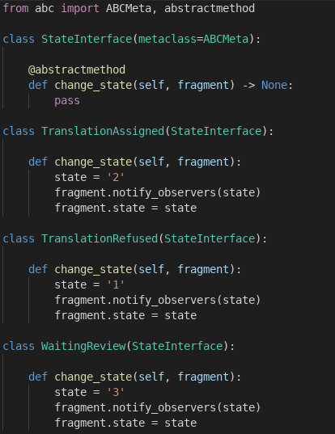
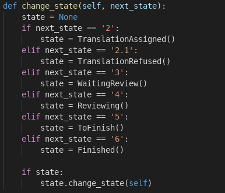

# Padrões Utilizados

## Histórico de Revisão:
| Data | Versão | Descrição | Autor |
|:---:|:---:|:---:|:---:|
| 30/06/2019 | 0.1 | Adicionando definição dos padrões utilizados pelo framework | Alexandre Miguel |
| 01/07/2019 | 0.2 | Adicionando tópicos composite e state | Rômulo Souza |
| 01/07/2019 | 0.3 | Adicionando tópico iterator | Rômulo Souza |

## Padrões Implementados pelo Grupo

Os seguintes padrões foram implementados no Backend do produto gerado, utilizando o Django REST Framework.

### Composite

O padrão **Composite** foi implementado para a criação dos tipos de elementos textuais da aplicação. Para sua implementação, foi criada uma classe abstrata TextComponent (model abstrata no django). Essa classe abstrata foi herdada pelo texto, que é a classe composta do composite e pelos fragmentos, que são as leafs. Atualmente, o único tipo de fragmento utilizado é o de tipo texto. O uso do composite, no entanto, permite que no futuro sejam implementados outros tipos de fragmento com mais facilidade. Além disso, facilita que realizemos operações em cada fragmento na lista de fragmentos, como calcular o valor total e reestruturar o texto traduzido.

### Iterator

O padrão **Iterator** permite a travessia de todos os fragmentos presente no texto. Haja vista que foi utilizado o composite, é feita a iteração em elementos do tipo TextComponent, possibilitando que seja iterado diferentes tipos de fragmentos. No python, o iterator é realizado automaticamente ao se utilizar:

No projeto, foi implementada uma classe iterator, para demonstrar o que ocorre por trás do iterator padrão do python:

### Observer

### State

O padrão **State** foi implementado para facilitar as mudanças de estados dos fragmentos. O fragmento possui um método que instancia as classes concretas do **State**, e chama o método de mudança de estado dentro destas, para o fragmento. Quando é chamado o método de mudança de estado, em cada classe concreta do **State**, há a referência do estado anterior e qual o próximo estado que o fragmento deve ir, além de chamar as notificações correspondentes à mudança de estado para os usuários.

### Front Controller

## Padrões Implementados pelo Django REST Framework
