# Padrões Utilizados

## Histórico de Revisão:
| Data | Versão | Descrição | Autor |
|:---:|:---:|:---:|:---:|
| 30/06/2019 | 0.1 | Adicionando definição dos padrões utilizados pelo framework | Alexandre Miguel |
| 01/07/2019 | 0.2 | Adicionando tópicos composite e state | Rômulo Souza |
| 01/07/2019 | 0.3 | Adicionando tópico iterator e adapter | Rômulo Souza |
| 01/07/2019 | 0.4 | Adicionando referências | Rômulo Souza |
| 01/07/2019 | 0.5 | Reestruturando a documentação | Alexandre Miguel |
| 01/07/2019 | 0.6 | Adicionando Sequência e Estrutura | Alexandre Miguel e Rômulo Souza |
| 01/07/2019 | 0.7 | Adicionando Diagramas refatorados e descrições de Observer e State | Alexandre Miguel e Letícia Meneses |
| 01/07/2019 | 0.8 | Adicionando Descrição e Estrutura do padrão Front Controller | Letícia Meneses |

## Padrões Implementados pelo Grupo

Os seguintes padrões foram implementados no Backend do produto gerado, utilizando o Django REST Framework.

### 1. Composite

O padrão **Composite** foi implementado para a criação dos tipos de elementos textuais da aplicação. Para sua implementação, foi criada uma classe abstrata **TextComponent** (model abstrata no django). Essa classe abstrata foi herdada pelo texto, que é a classe composta do composite e pelos fragmentos, que são as leafs. Atualmente, o único tipo de fragmento utilizado é o de tipo texto. O uso do composite, no entanto, permite que no futuro sejam implementados outros tipos de fragmento com mais facilidade. Além disso, facilita que realizemos operações em cada fragmento na lista de fragmentos, como calcular o valor total e reestruturar o texto traduzido.

#### 1.1. Estrutura

A Aplicação do padrão é fundamentada por uma estrutura, cuja adaptação se fez necessária por conta do uso do Django REST Framework com a implementação das Generics views.

##### 1.1.1. Estrutura Padrão

Estrutura disposta como padrão para implementação do padrão.

##### 1.1.2. Estrutura Implementada

Estrutura implementada no projeto, com a aplicação dos fragments

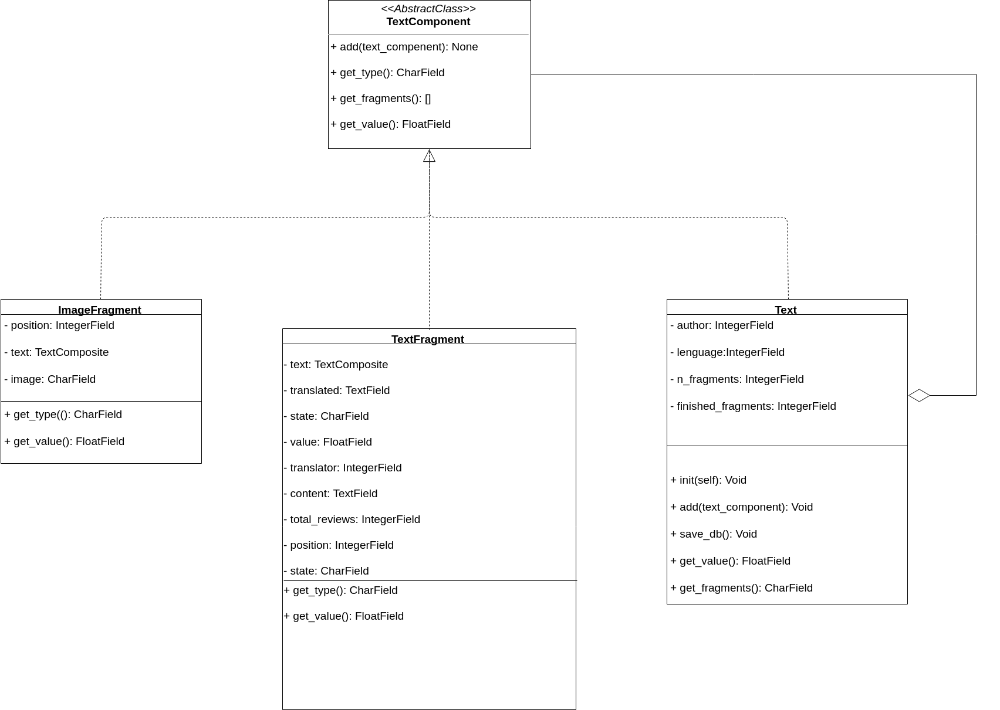

#### 1.2. Sequência

Os diagramas de sequência foram implementados para visibilidade da sequência realizada em requisições conforme o padrão implementado, em comparação com a sequência do padrão original.

##### 1.2.1. Diagrama de Sequência Padrão

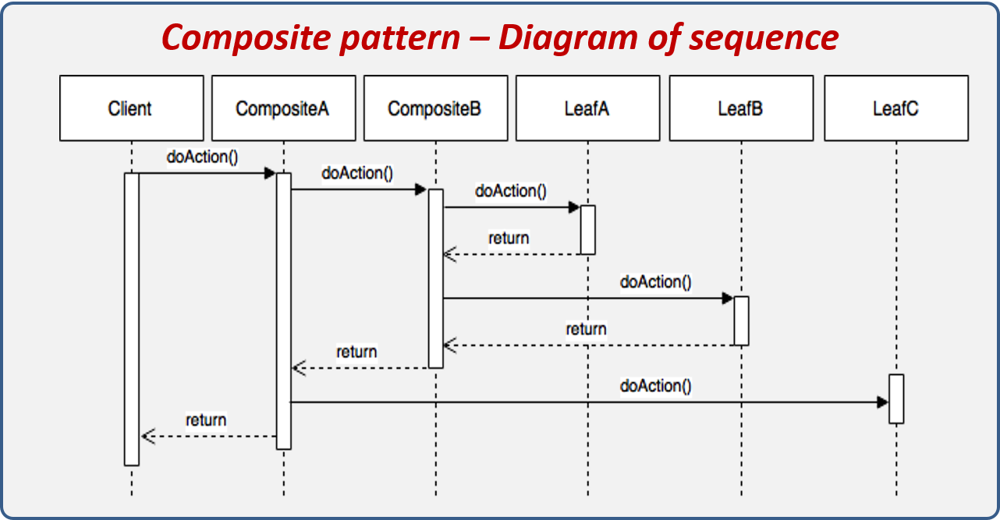

##### 1.2.2. Diagrama de Sequência Implementada

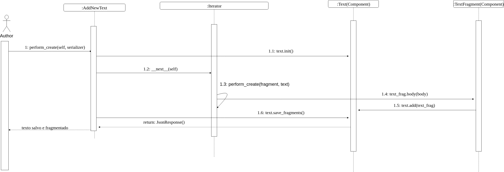

#### 1.3. Código Implementado

Essa seção apresenta os códigos implementados na aplicação.

##### 1.3.1. Classe Abstrata ***TextComponent***

Essa classe define os métodos de retorno de preço e conteúdo, comum a todas as leafs e ao composite

##### 1.3.2. Classe ***Text*** (Composite)

Implementação da Classe ***Text*** que atua como composite para a aplicação.

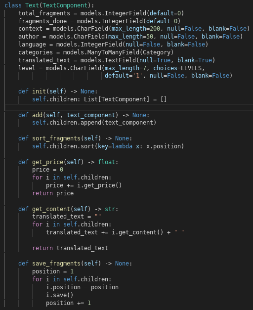

##### 1.3.3. Classe ***TextFragment*** (Leaf)

IMplementação da classe ***TextFragment*** com os métodos sobrescritos e a conexão poor meio de chave estrangeira com o Composite na classe ***Text***

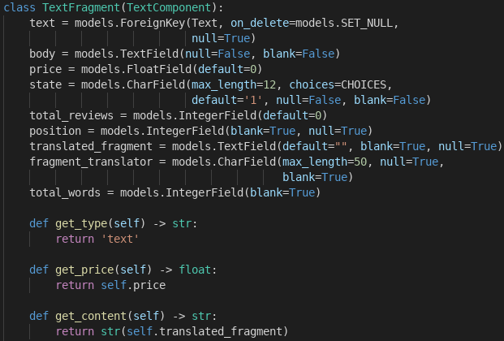

### 2. Iterator

O padrão **Iterator** permite a travessia de todos os fragmentos presente no texto. Tendo em vista que foi utilizado o composite, é feita a iteração em elementos do tipo ***TextComponent*** , possibilitando que seja iterado diferentes tipos de fragmentos. No python, o iterator é realizado automaticamente ao se utilizar:

No projeto, foi implementada uma classe iterator, para demonstrar o que ocorre por trás do iterator padrão do python.

#### 2.1. Estrutura

##### 2.1.1. Estrutura Padrão
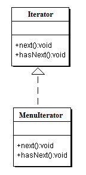

##### 2.1.2. Estrutura Implementada
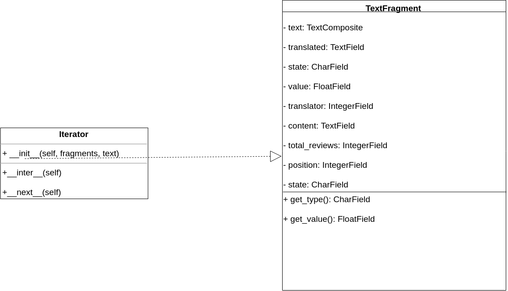

#### 2.2. Sequência

Os diagramas de sequência foram implementados para visibilidade da sequência realizada em requisições conforme o padrão implementado, em comparação com a sequência do padrão original.

##### 2.2.1. Diagrama de Sequência Padrão

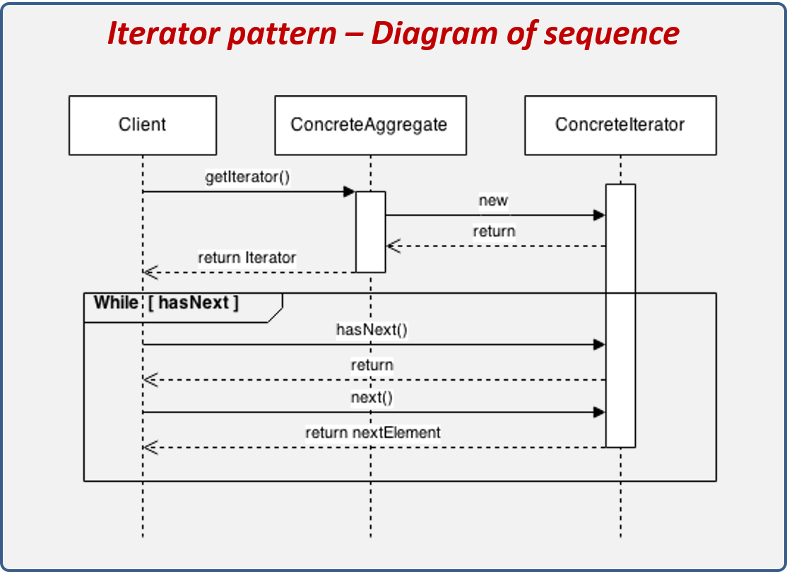

##### 2.2.2. Diagrama de Sequência Implementada

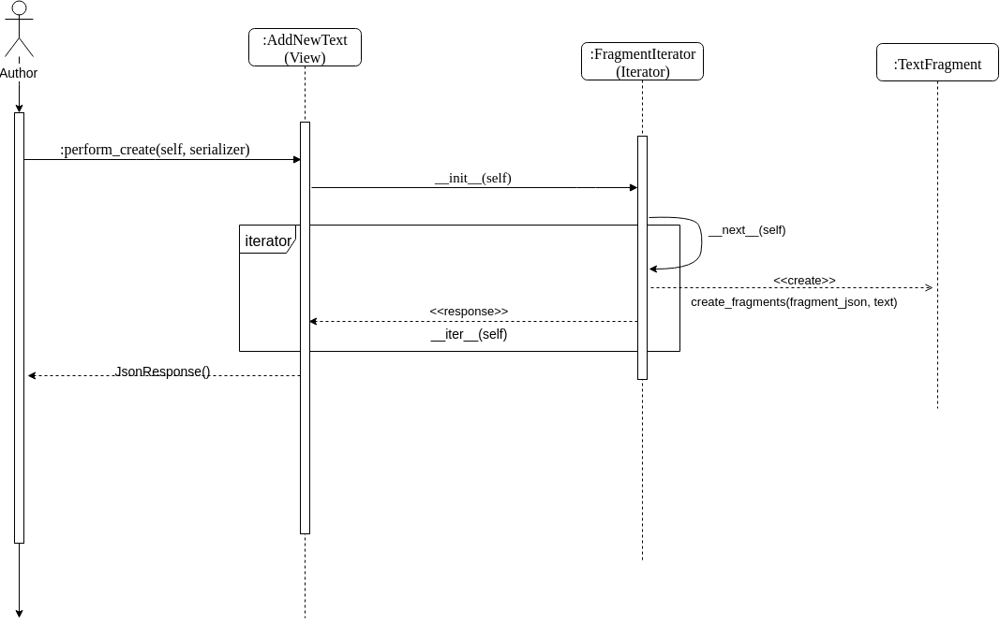

#### 2.3. Código Implementado

O Código Implementado foi idealizado como uma modificação de uma iteração padrão do próprio python, com classes alteradas para performar a criação de um fragmento de texto de acordo com uma submissão de texto oriunda do front-end.

##### 2.3.1. Classe ***FragmentIterator***

Essa classe implementa o iterator, conforme os métodos padrões do Django para iteração sobre itens, como ***__init__*** , ***__iter__*** e ***__next__***

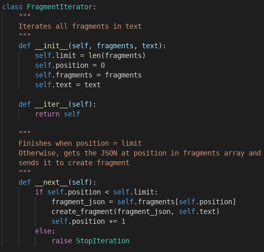

##### 2.3.2 Chamado do ***Iterator***

O Iterator é utilizado para salvar os fragmentos criados na função de adicionar um novo texto.

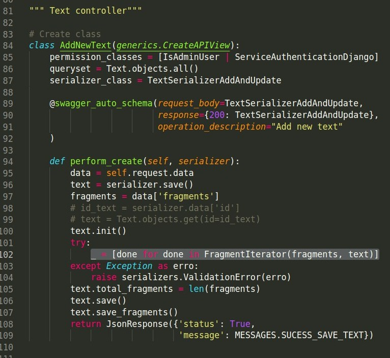

### 3. Observer

Dada a necessidade de criação de Notificações de acordo com a transição de estados, foi utilizada a implementação de um padrão **Observer** que identifica a transição de estados de tradução do texto, permitindo comportamentos diferentes para a criação de notificações de acordo com o usuário alvo daquela notificação (como Autores, Tradutores e Revisores). Em uma primeira versão, o padrão foi aplicado individualmente e, em uma versão posterior, seu funcionamento foi associado ao funcionamento do padrão State.

#### 3.1. Estrutura

A Estrutura do padrao Observer presume uma classe cujas alterações são identificadas por uma série de classes que implementam uma classe abstrata. Assim, a estrutura padrão está disposta a seguir, por meio de um exemplo de estrutura obtido dos arquivos de referência.

##### 3.1.1. Estrutura Padrão

Exemplo padrão da estrutura do padrão Observer, conforme estudado e referenciado no arquivo [Padrões GoFs Comportamentais](../gof/comportamentais).

#### 3.1.2. Estrutura Implementada

É possível notar, pela estrutura implementada, que essa se mantém fiel à estrutura mínima, com a classe abstrata ***Observer*** sendo implementada pelas classes ***ConcreteObserverAuthor***, ***ConcreteObserverTranslator*** e ***ConcreteObserverRevisor*** que são notificadas pela transição do atributo _state_ da classe ***TextFragment***. Cada Observer, por sua vez, herda a função **notify** que ontém o id do Fragmento que as instancia, o estado atual desse fragmento e o próximo estado, sendo dados suficiente para que cada Observer crie uma notificação conforme o contexto da transição e referenciando o usuário necessário.

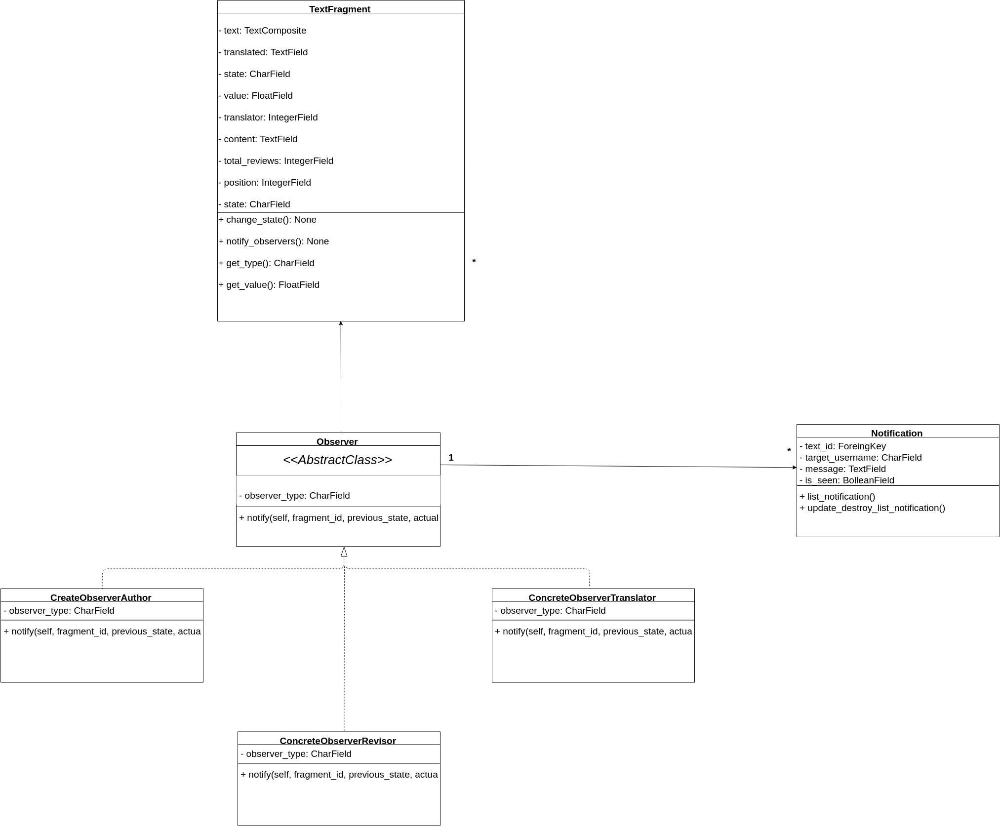

#### 3.2. Sequência

O Diagrama de sequência, para esse padrão, permite visualizar não só seu funcionamento mas também como ocorreu sua integração com o padrao ***State*** cujo detalhamento ocorrerá no próximo tópico do Documento.

##### 3.2.1. Diagrama de Sequência Padrão

Com o diagrama padrão, ou de estrutura mínima referenciado, é possível perceber que a criação dos objetos Observers ocorrem pelo cliente, de forma que esses objetos são adicionados a um vetor ou outra estrutura de dado que permita uma iteração para a notificação desses elementos.

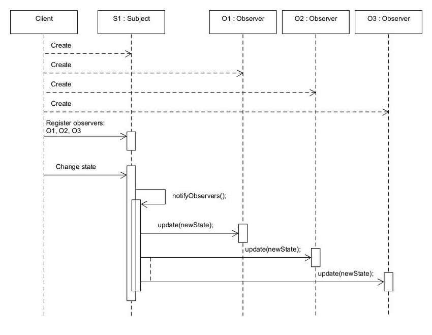

#### 3.2.2. Diagrama de Sequência Adaptado

Para a adaptação ao Django REST Framework bem como ao uso das extensões da classe generics, foi necessário que o próprio subject, ou no caso a instância da classe TextFragment, criasse a lista de observers através da função **notify_observers**, que instancia esses elementos e ativa, de maneira iterada, a função **notify** de cada um desses elementos, que por sua vez cria uma notificação conforme a necessidade da transição de estados e o usuário cuja notificação se destina.

#### 3.3. Código Implementado

O Código implementado demonstra o que foi referenciado, como as chamadas de funções que levam à notificação dos observers para uso do padrão.

##### 3.3.1 Código Interface ***Observer***

##### 3.3.2 Código Interface ***ConcreteObserverAuthor***

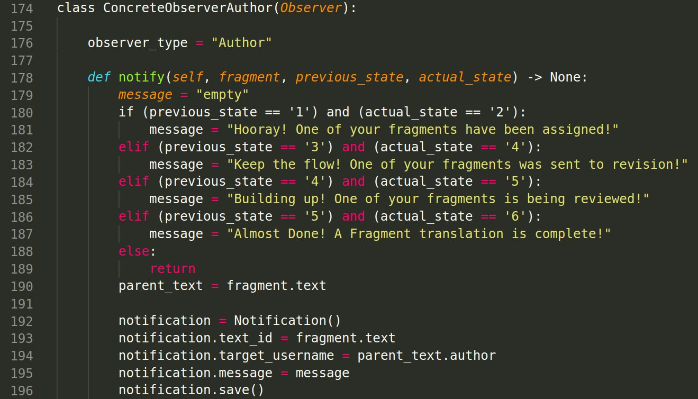

##### 3.3.3 Código Interface ***ConcreteObserverTranslator***

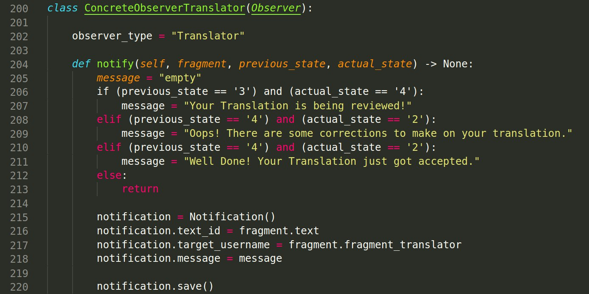

##### 3.3.4 Código Interface ***ConcreteObserverRevisor***

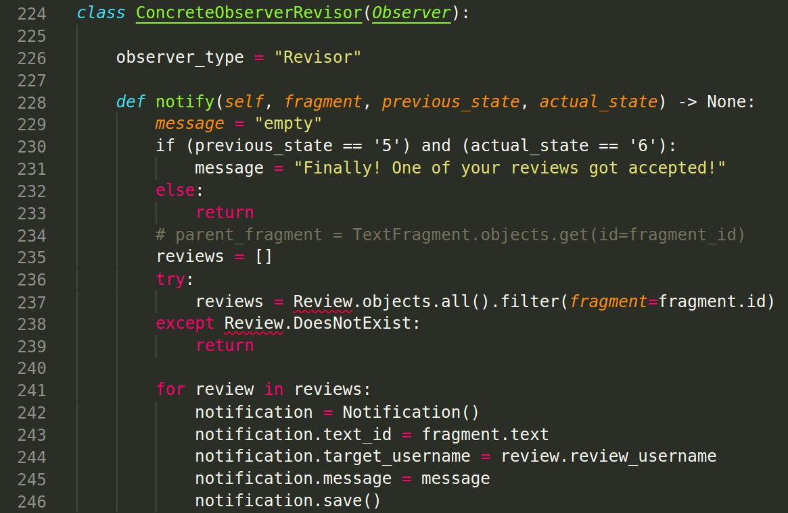

##### 3.3.5 Código de Chamada dos Observers na ***TextFragment***

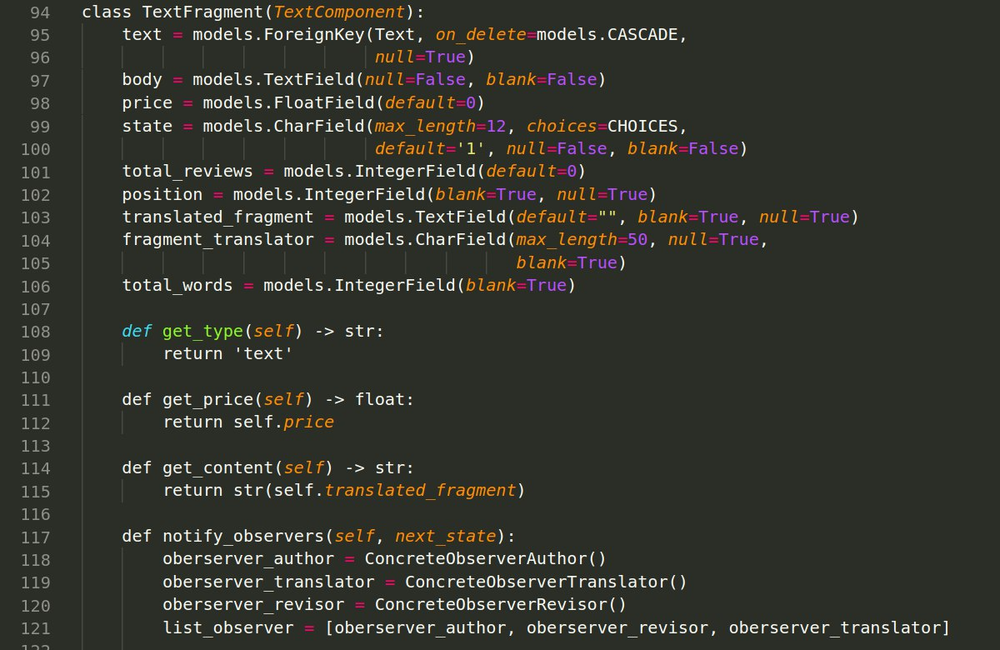

### 4. State

O padrão **State** foi implementado para facilitar as mudanças de estados dos fragmentos. O fragmento possui um método que instancia as classes concretas do **State**, e chama o método de mudança de estado dentro destas, para o fragmento. Quando é chamado o método de mudança de estado, em cada classe concreta do **State**, há a referência do estado anterior e qual o próximo estado que o fragmento deve ir, além de chamar as notificações correspondentes à mudança de estado para os usuários.

#### 4.1 Estado

O Seguinte diagrama representa os estados de um fragmento de texto na aplicação, que vai de um estado inicial, aguardando ser selecinado por um tradutor, depois para o estado em que está sendo traduzido,  prosseguindo para o estado em que aguarda por uma revisão, o estado em que é revisado e o estado pronto, em que aguarda os demais fragmentos atingirem esse estado para finalização, por vez, da tradução do texto.

#### 4.2. Estrutura

A Estrutura padrão do método State faz denotar a necessidade de uma transição de estados do fragmento da tradução na aplicação, conforme a motivação de implementação do padrão em sua forma mais generalista.

##### 4.2.2. Estrutura Padrão

A Estrutura mais comum do padrão faz uso de classes concretas que herdam de uma interface que implementa as formas com que as transições de um estado serão feitas, o que é aplicado a um contexto representado por outra classe.

##### 4.2.3. Estrutura Implementada

A Estrutura implementada de fato segue, de muitas formas a estrutura padrão, porém contemplando os possíveis estados do fragmento na plataforma, sendo que cada instância de estado é realizada por objetos da classe ***TextFragment***.

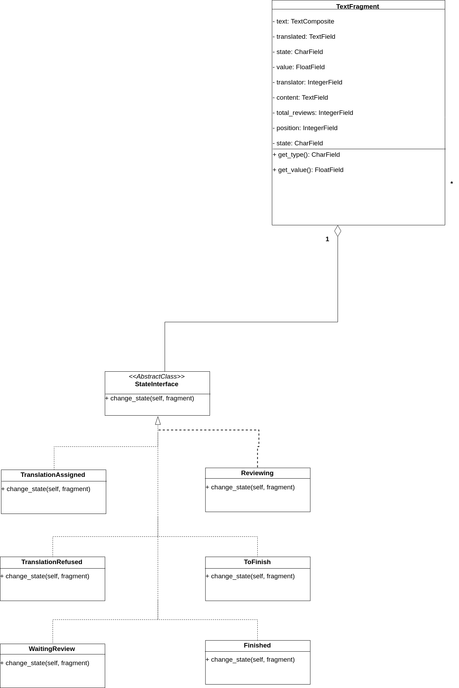

#### 4.3. Sequência

As divergências maiores ocorreram na implementação da sequência com que esse padrão é normalmente aplicado e a forma como, efetivamente, foi implementado na aplicação, contemplando a estrutura de classes necessára ao utilizar uma estratégia embasada pelo uso de generics.

##### 4.3.1. Diagrama de Sequência Padrão

O Diagrama de sequência padrão reflete as transições de estados que refletem o elemento context a partir de uma requisição externa inicial, surgindo do cliente, que define o primeiro estado instânciado, permitidno ainda que um estado defina o próximo estado ao qual o elemento Context será associado.

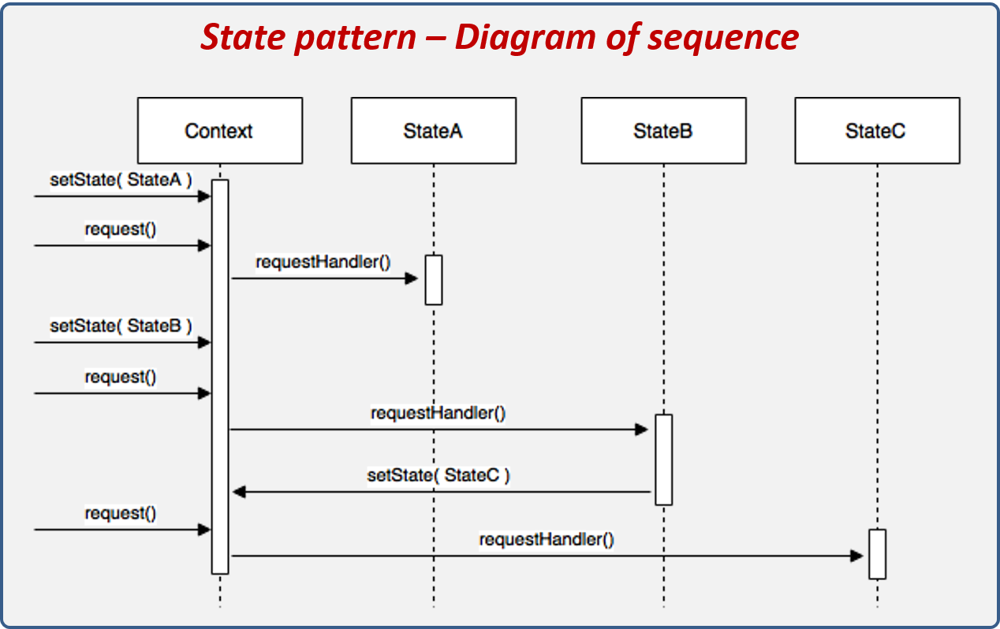

#### 4.3.2. Diagrama de Sequência Adaptado

A Alteração da sequência estabelecida em relação ao modelo padrão se dá principalmente pelo fato de que o próprio elemento ***State*** define as demais instâncias, sendo responsável pelo prosseguimento dos estados da aplicação e, além disso, foi incubido a esse padrão a responsabilidade de notificar o context, representado pela instância da classe ***TextFragment*** a respeito da notificação dos elementos observers, dado que esses elementos estão sujeitos à alteração do atributo state, que grava um dado a respeito do estado em que aquele fragmento se encontra. Essa solução foi necessára devido à impossibilidade de salvar os elementos state no banco, sendo necessário sua implementação em tempo de execução.

#### 4.4. Código Implementado

##### 4.4.1 Classe Abstrata ***StateInterface*** e Classes Concretas

<<<<<<< HEAD
https://hangouts.google.com/call/BGkNzqjT-yxA8nFgR9NpAEEE

##### 4.4.2. Função ***change_state*** na Classe ***TextFragment***

### 5. Front Controller
O padrão **Front Controller** foi implementado no projeto com a finalidade de tratar as solicitações feitas pelo site, em que um Manipulador (objeto) recebe requisições do servidor. Recolhendo as informações necessárias da **URL, é capaz de definir qual ação será feita e passa a tarefa a um Comando(objeto) de executar a ação. No projeto A implementação do padrão herda de uma APIView e os métodos GET ou POST foram sobrescritos.
#### 5.1. Estrutura
A estrutura do **Front Controller** dispõe de objetos **Manipulador** e **Comando**, o Comando escolhe qual url usar para o _response_ e o Manipulador qual o _Comando_ correto para executar.
##### 5.1.1. Estrutura Padrão

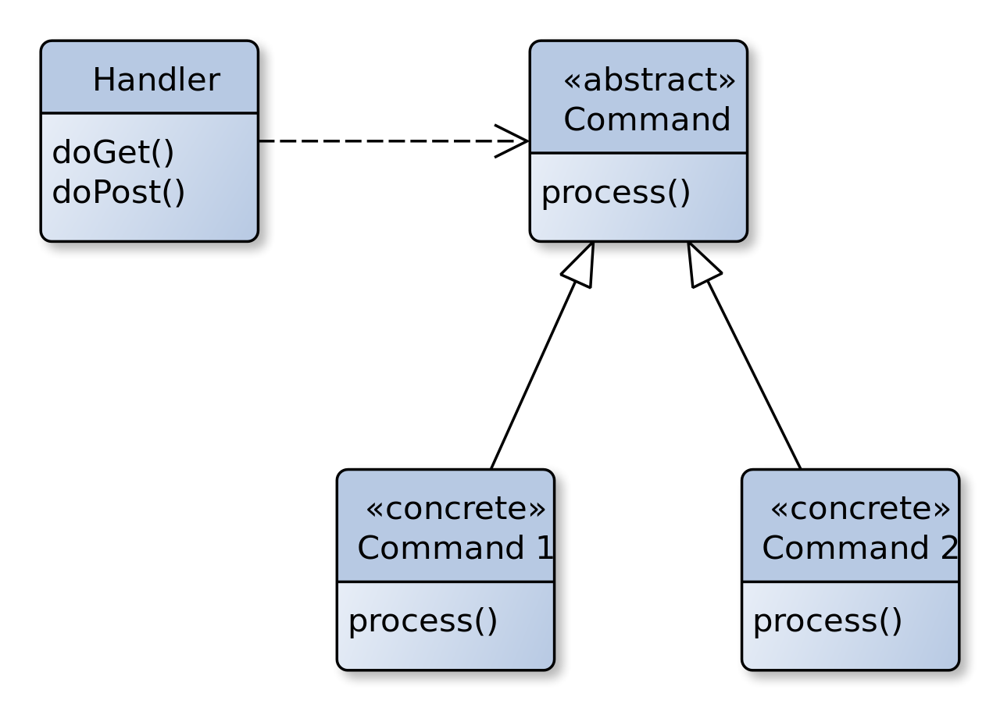

#### 5.2. Sequência

##### 5.2.1. Diagrama de Sequência Padrão

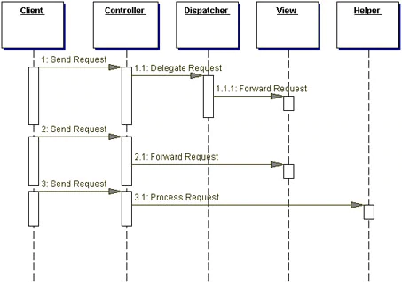

#### 5.3. Código Implementado

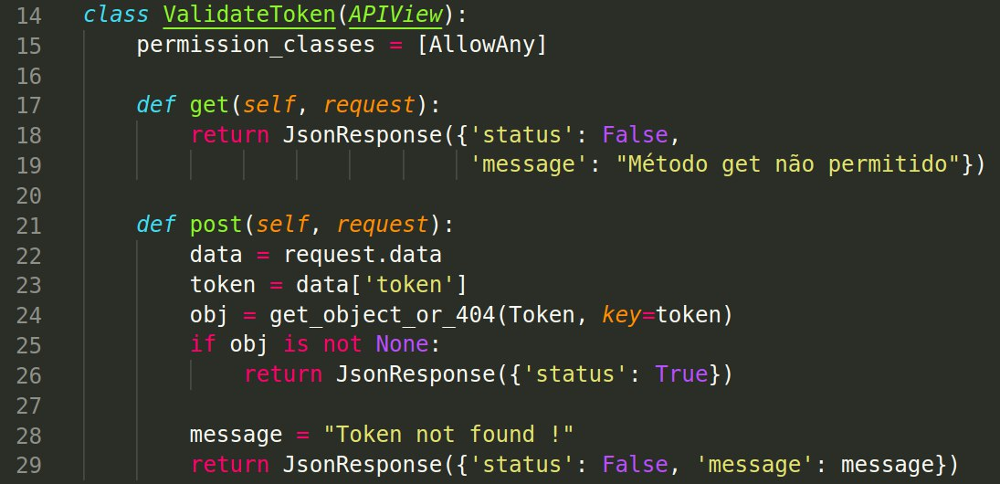

## Padrões Implementados pelo Django REST Framework

### Adapter

A serializer do Django REST Framework pode ser considerada como um exemplo do padrão **Adapter**. A serializer transforma um objeto do tipo JSON em um objeto do tipo Model do django, e vice-versa, permitindo a comunicação com o banco de dados através de diferentes interfaces.

## Referências

* [Padrão Observer](https://refactoring.guru/design-patterns/composite)
* [Guru Design Patterns](https://refactoring.guru/design-patterns/)
* [Padrão Iterator](https://reactiveprogramming.io/books/design-patterns/en/catalog/iterator)
* [Documentação em Java de Front Controller](https://www.oracle.com/technetwork/java/frontcontroller-135648.html)
* [Padrão State](https://reactiveprogramming.io/books/design-patterns/en/catalog/state)
* RAVINDRAN, A. Django Design Patters and Best Practices. Livery Place, 35 Livery Street, Birmingham B3 2PB - UK: Packt Publishing Ltd., 2015.
