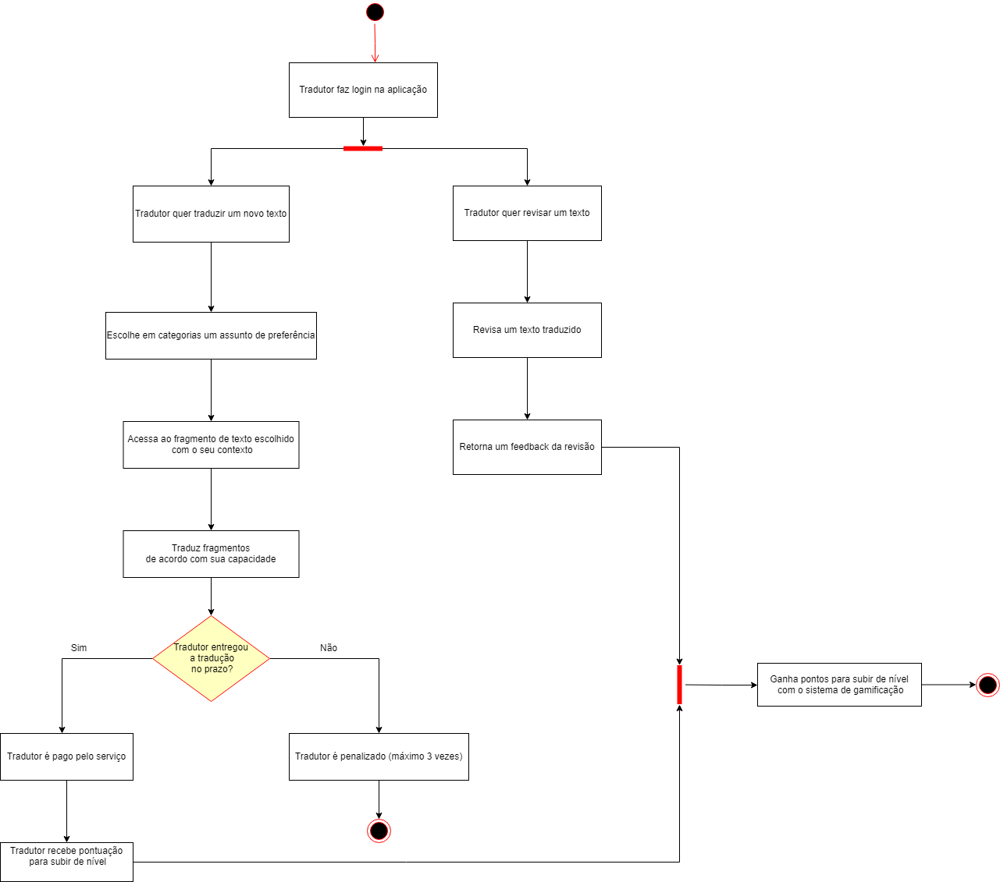
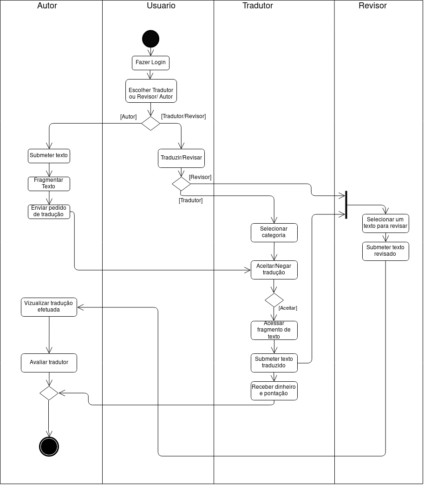

# UML Dinâmicos

## Histórico de Revisão:
| Data | Versão | Descrição | Autor |
|---|---|---|---|
| 26/04/2019 | 0.1 | Adicionando diagrama de sequência de submissão e acompanhamento | Victor Hugo, Renan Schidt |
| 26/04/2019 | 0.2 | Adicionando diagrama de atividades e de sequência de escolha e acesso de fragmento de texto  | Letícia Meneses, Luiz Guilherme|
| 29/04/2019 | 0.3 | Adicionando diagrama de colaboração | Gabriela Guedes e Helena Goulart |
| 03/05/2019 | 0.4 | Adicionado diagrama de atividade | Davi Alves e João Robson|
| 06/05/2019 | 0.5 | Adicionado introdução do documento e aos diagramas | Rômulo Souza|

## 1. Introdução

Diagramas dinâmicos são compreendidos como diagramas de interação, diagramas de máquinas de estados e diagramas de atividade. São diagramas usados ​​para descrever o comportamento interno de um sistema. Sâo exemplos de diagramas dinâmicos: diagrama de sequência, diagrama de colaboraçâo, diagrama de atividades, diagrama de estados. 

## 2. Artefatos

### 2.1. Diagrama de Sequência

O diagrama de sequência é a solução dinâmica de modelagem em UML mais relevante, pois incide especificamente sobre linhas da vida - período entre a fase inicial e a fase final - de um projeto. O diagrama representa os processos e objetos que vivem simultaneamente, e as mensagens trocadas entre eles para desempenhar uma função antes do término da linha da vida.

#### 2.1.1. Submissão e Acompanhamento de Texto

#### 2.1.2. Acesso e Escolha de Fragmento

### 2.2. Diagrama de estados

Um estado modela uma situação durante a qual alguma condição (usualmente implícita) se
mantém. Essa invariância tanto pode representar uma situação estática, como um objeto aguardando
que um evento externo ocorra, quanto condições dinâmicas, como um processo apresentando um
determinado comportamento. O diagrama de estados procura apresentar os vários estados pelos quais um objeto pode passar.

#### 2.2.1. Diagrama 1

### 2.3. Diagrama de Colaboração

Diagrama de colaboração é um diagrama dinâmico que mostra a interação entre objetos e/ou partes usando mensagens sequenciais. É um diagrama que não se preocupa com temporalidade, com o foco na organização estrutural dos projetos.

#### 2.3.1. Diagrama 1

### 2.4 Diagrama de Atividades

O diagrama de atividades é um diagrama UML utilizado para modelar o aspecto
comportamental de processos. Neste diagrama, uma atividade é modelada como uma
sequência estruturada de ações, controladas potencialmente por nós quanto a decisão e sincronismo. O foco, portanto, está nos procedimentos, processos de negócio e fluxo de trabalho.

#### 2.4.1. Diagrama 1

Versão 1.0

Versão 2.0

## Referências

* [Diagramas UML](https://www.lucidchart.com/pages/pt/o-que-e-uml)
* [Diagrama de Atividade e Diagramas de Estado](http://www.dca.fee.unicamp.br/~gudwin/ftp/ea976/AtEst.pdf)

