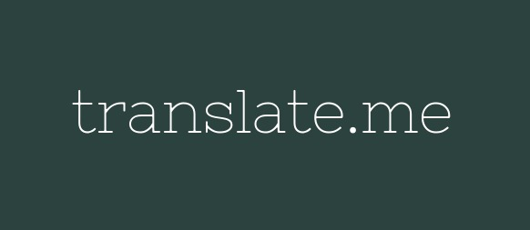
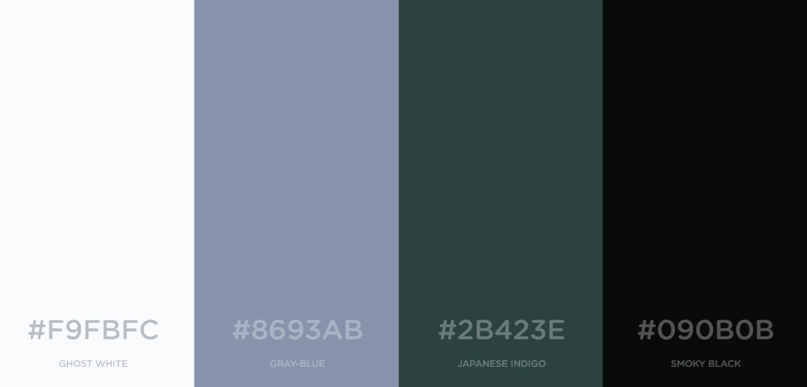

## Histórico de Revisão:
| Data | Versão | Descrição | Autor |
|---|---|---|---|
|18/04/2019|1.0|Primeira versão do documento|Gabriela Guedes e Helena Goulart|

## Qual é o tipo de linguagem?
A linguagem será conversativa, para que o usuário tenha a sensação de que a plataforma está conversando com ele, tornando a navegação simples e interativa.

## Como serão os feedbacks para os usuários?
Através da análise de sites que o grupo se identifica mais com o visual, compreende-se a necessidade de aplicar feedbacks em menor escala.

1. A alteração da cor de elementos ao serem selecionados, tais como opções do menu, que serão apresentados em tons mais claros da paleta de cores e ao serem selecionados, mudarão para o tom de azul acinzentado;  
2. Dupla checagem através de avisos pop-ups, como confirmação de envio do artigo e interesse na participação da tradução;  
3. Cores de acordo com a paleta determinada, que inclui tons sóbrios para retratar a seriedade do ambiente acadêmico, tais como verde escuro e azul acinzentado;
4. Mudança de cores para avisos de natureza distintas, como conclusão do trabalho de tradução, confirmação no pedido de tradução.

## Fontes
#### Logo translate.me

A logo deve estar na fonte *Nixie One*

#### Texto do site

Todos os textos do site devem estar na fonte *Raleway*

## Cores

 

* **Cor primária:** 
    **#2B423E**  
		Cor contrastante: Branco fantasma  
		Relação de contraste: 10.36  
 
* **Cores secundárias:**	
	**#8693AB**  
		Cor contrastante: Verde  
		Relação de contraste: 3.47  
	**#090B0B**  
		Cor contrastante: Branco fantasma  
		Relação de contraste: 19  
	**#F9FBFC**  
		Cor contrastante: Verde  
		Relação de contraste: 10.36  

